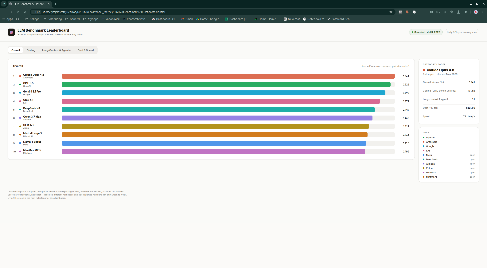

# LLM Benchmark Dashboard

A clean, single-file dashboard that ranks frontier and open-weight language models across the benchmarks that actually matter — overall Arena Elo, coding (SWE-bench Verified), long-context & agentic performance, and cost vs. speed.

Built as a self-contained HTML file: no build step, no dependencies to install, no framework to configure. Open it in a browser and it runs. Point it at an API and it goes live.



---

## Features

- **Four benchmark views** — Overall (Arena Elo), Coding (SWE-bench Verified %), Long-Context & Agentic (0–100 composite), and a combined Cost & Speed panel.
- **Bold per-lab colors** — every model gets a distinct hue that stays consistent across every view and the legend.
- **Hover for detail** — mousing over any row surfaces that model's full stat line in the side panel (release date, all metrics, cost, speed).
- **Sorted automatically** — each view ranks models by that metric; cost sorts cheapest-first, speed sorts fastest-first.
- **Live or offline** — ships with a curated snapshot as a built-in fallback; set one URL to switch to live daily data.
- **Zero dependencies** — a single HTML file. Works from `file://`, any static host, or a wall display.

---

## Quick start

**Run the full app (live data):**

```bash
cd backend
uv sync
uv run uvicorn app.main:app --reload --port 8420
```

Then open **<http://127.0.0.1:8420/>** — the backend serves the dashboard itself, wired to its own `/v1/benchmarks/latest` endpoint. One process, one URL, no manual editing.

**Just want to look at it offline (snapshot data)?** Open `LLM Benchmark Dashboard (standalone).html` directly in a browser instead — no backend needed.

**Want to edit it?** Edit `LLM Benchmark Dashboard.dc.html` — it holds the template and logic in a readable form. The `(standalone).html` file is the bundled build that the backend serves; it's not regenerated automatically, so mirror any logic changes into it too.

---

## How the backend wiring works

`backend/app/main.py` does two things:

- Serves the API: `GET /v1/benchmarks/latest` (see `app/routers/benchmarks.py`), returning the data in `app/data.py` shaped per `app/schemas.py`.
- Serves the dashboard: `GET /` returns `LLM Benchmark Dashboard (standalone).html` directly, so the page and the API share an origin.

The dashboard's `BENCHMARK_API_URL` is set to the relative path `/v1/benchmarks/latest`, so it resolves against whatever origin serves the page — no host/port to hardcode. On load it shows a **Loading…** badge, then flips to **Live** once the fetch resolves. If the API is unreachable, it falls back to the bundled snapshot and shows **Snapshot (API unreachable)**.

Useful checks while the server is running:

- `curl http://127.0.0.1:8420/health` — liveness check
- <http://127.0.0.1:8420/docs> — interactive API docs

See **[API Integration Guide](docs/API-Integration-Guide.md)** for the exact response shape, a field-by-field table, CORS notes, timestamp handling, and an optional daily auto-refresh snippet.

---

## Data & accuracy

The bundled numbers are a **curated snapshot** compiled from public leaderboard reporting (Arena, SWE-bench Verified, provider disclosures). They're directional, not exact — labs use different harnesses and self-reported numbers shift week to week. The live API refresh is the intended source of truth once connected.

---

## Project structure

```text
LLM Benchmark Dashboard.dc.html            # Editable source (template + logic)
LLM Benchmark Dashboard (standalone).html  # Bundled, offline-ready build
docs/API-Integration-Guide.md              # How to connect a live backend
backend/                                   # FastAPI app serving live benchmark data
  app/main.py                              # App entrypoint, CORS, /health
  app/routers/benchmarks.py                # GET /v1/benchmarks/latest
  app/data.py                              # Snapshot data served by the API
  app/schemas.py                           # Pydantic response schema
  tests/                                   # pytest suite
```

---

## License

MIT — do what you like, no warranty.
